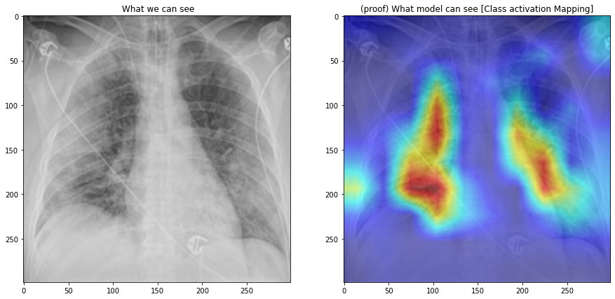

# Covid-Pneumonia-Normal-Classifier_99-accuracy_98-f1score
This repossitory contains a deep learning model to predict  if a patient is suffering from covid or pneumonia or the person doesn't suffer from any of those disease using there chest X ray ,  I have used classical transfer learning method with  a state of the art pretrained model on imagenet ( resnet200d ) as a backbone and fine tuned its final layers with some heavy augmentaions with automated mixed precision training using pytorch framework . The model shows some excellent results with a 98% f1 score and 99% accuracy in a completely hidden dataset and for the convienence i have added grad cam so that we can see what model is seeing to predict . 

# Model 
The model backbone used here is resnet200d which has imagenet prertrained weights, A bit  about why resent200d and why not other architectures such as efficient nets , nfnets , vgg etc . resnet200d is supposed to perform better for xrays images from my experimentations and effnets and other perform not as good as resnet200d for xrays images although i tried all the other architectures that i could possibly try and came to the conclusion that resnet200d indeed is the king for the backbone of my model the final layers are just Linear layers to classify into 3 categories i.e Covid , pneumonia and normal using crossentropyloss as loss function . I have used ptyorch as i find it more flexible and it suits my working type . A bit about dataset images were already downscaled to 256*256 pixels hence i trained my model with these images and surpsingly model perform way better than i expected , i have done some heavy augmentations using albmunetations libarary with automated mixed precision training  , i tired to use cutmix , mixup augmentations but they gave poor performance . I have also  added Grad Cam to see what model is seeing .

# Metric used 
Model performance has been calculated using following metrics . Below are the model performance calculated from the test set.

accuracy = 0.9909968262193147 , f1_score = 0.9801513517345098 , precision = 0.9891503234296438 , recall = 0.9722867684680466

# Grad Cam

# Datasets [ Citations / Credits ]
Train dataset :- 
The model is trained and validated from these 3 datasets by stratifing the folds into 5 splits , the model is trained and validated using single fold and still perform excellent thanks to the datasets authors for providing these datasets
<a href="https://www.kaggle.com/tawsifurrahman/covid19-radiography-database">Train dataset 1 </a> ,
<a href="https://www.kaggle.com/bachrr/covid-chest-xray">Train dataset 2 </a> , 
<a href="https://www.kaggle.com/paultimothymooney/chest-xray-pneumonia">Train dataset 3 </a>

Test dataset:-
The model is tested from these 3 datasets 
<a href="https://www.kaggle.com/nabeelsajid917/covid-19-x-ray-10000-images">Test dataset 1 </a> , 
<a href="https://www.kaggle.com/khoongweihao/covid19-xray-dataset-train-test-sets">Test dataset 2 </a> ,
<a href="https://www.kaggle.com/tawsifurrahman/covid19-radiography-database">Test dataset 3 </a>

# Model weights 
I have uploaded model weights <a href="https://www.dropbox.com/sh/g3eqsmy1wkndns6/AABob4nAMnbo0k9jEdS4oKc3a?dl=0">here</a> as the model weights is quite big in size .

# Request 
If you like the work that i did here than please fork it and star it , it will motivate us developers to create more such models for the sake of our world . #lets_fight_together.
